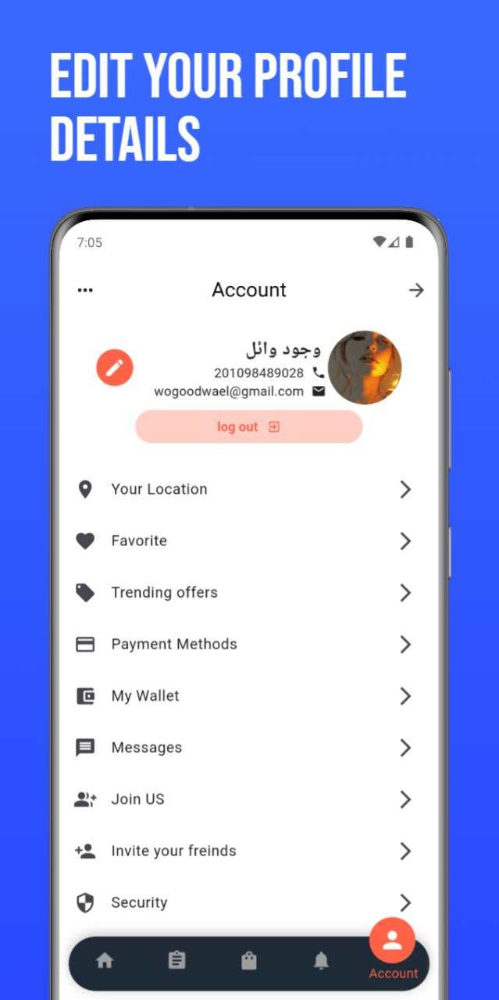
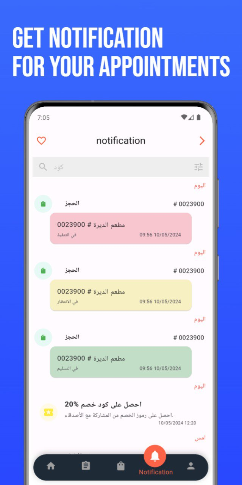
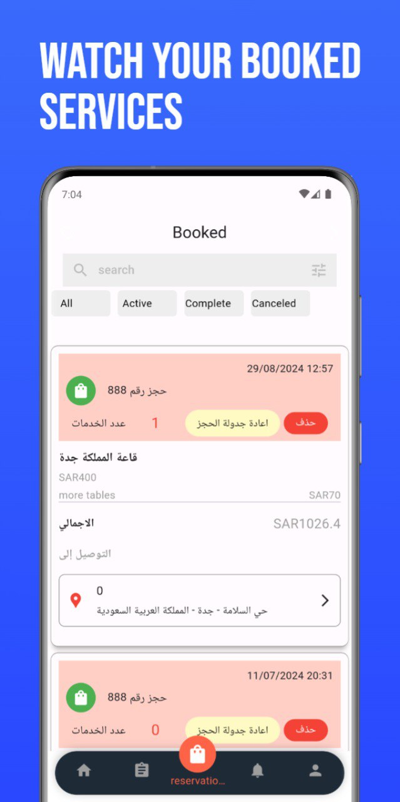

# Sudia Events

A Flutter application for managing and discovering events in Saudi Arabia.

## Screenshots

Here are some screenshots of the application:

| Screenshot 1 | Screenshot 2 |
|-------------|-------------|
|  |  |
| Screenshot 3 | Screenshot 4 |
|  |  |
| Screenshot 5 | Screenshot 6 |
|  |

## Features

- 🔍 Browse and search events across Saudi Arabia
- 📅 View event details including date, time, and location
- 🎫 share invitation card for events
- 👤 User authentication and profile management
- 📱 Responsive design for both mobile and tablet
- 🌐 Arabic and English language support
- 📍 Location-based event discovery
- 🔔 Event reminders and notifications
- 💳 Secure payment processing
- ⭐ Save favorite events
- 📗 Book your restaurant according to your events events

## Getting Started

1. Clone the repository
2. Install dependencies:
